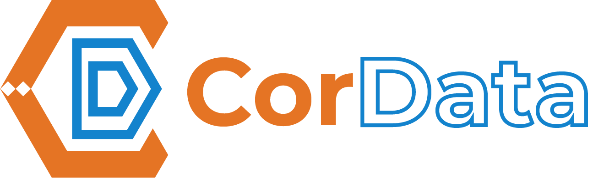

<h1 align="center"></h1>

<strong>Data science & AI for healthcare, science, and industry.</strong>

  
  
  
  
  
  
  

---

English version

## Who we are

**CorData** turns data into working solutions and knowledge.
We provide **analysis**, **consulting**, and **training** across **statistics**, **computer science**, **biostatistics**, **epidemiology**, **healthcare**, **scientific research**, **industry**, and **artificial intelligence**.

### What we do
- End‑to‑end **data science** projects (from data capture to production).
- **Machine Learning** and **AI** (including privacy‑preserving and federated approaches).
- **Biostatistics** and **epidemiology** for clinical research and public health.
- **Data platforms & pipelines** for reproducible research and industry.
- **Training** on R, Python, ML/AI, reproducibility, and MLOps.

### How we work
- **Reproducibility** first: `targets`, `renv`, `Docker`, `Make`, `Git`.
- ML stack: **R + tidymodels**, **Python + PyTorch/TensorFlow**.
- **Privacy‑by‑design** and robust software engineering practices.
- Preference for **open source** and clear documentation.

### Focus areas
Healthcare & life sciences, food safety & surveillance, clinical NLP, biomedical signals & imaging, Industry 4.0, scientific research projects.

### Work with us
- 🔎 Browse repositories and pinned projects.
- 🐛 Open an **issue** for bugs or feature requests.
- 🔀 Submit a **pull request** following each repo’s CONTRIBUTING guide.
- 💬 Join discussions—feedback and ideas are welcome.

### Contact
- ✉️ **Mail**: info@cordatasrls.com
- 🧭 GitHub: **@cordata**
- 🌐 Website: ttp://cordatasrls.com

> _Licenses may differ per repository; see each project’s **LICENSE** file._

---

## Chi siamo

**CorData** è una realtà che sviluppa soluzioni e conoscenza a partire dai dati.
Ci occupiamo di **analisi**, **consulenze** e **formazione** in ambito **statistico**, **informatico**, **biostatistico**, **epidemiologico**, **sanitario**, **scientifico**, **industriale** e **intelligenza artificiale**.

### Cosa facciamo
- Progetti di **data science** end‑to‑end (dalla raccolta alla messa in produzione).
- **Machine Learning** e **AI** (inclusi approcci privacy‑preserving e federati).
- **Biostatistica** ed **epidemiologia** per ricerca clinica e sanità pubblica.
- **Piattaforme e pipeline dati** riproducibili per ricerca e industria.
- **Formazione** su R, Python, ML/AI, riproducibilità e MLOps.

### Come lavoriamo
- **Riproducibilità** prima di tutto: `targets`, `renv`, `Docker`, `Make`, `Git`.
- Stack ML: **R + tidymodels**, **Python + PyTorch/TensorFlow**.
- Pratiche **privacy‑by‑design** e attenzione alla qualità del software.
- Preferenza per **open source** e documentazione chiara.

### Aree di interesse
Sanità e life sciences, sorveglianza e sicurezza alimentare, NLP clinico, segnali e immagini biomediche, industria 4.0, progetti di ricerca scientifica.

### Come collaborare
- 🔎 Sfoglia i repository e i progetti fissati in alto.
- 🐛 Apri una **issue** per bug o richieste.
- 🔀 Proponi una **pull request** seguendo le linee guida di CONTRIBUTING dei singoli repo.
- 💬 Partecipa alle discussioni: feedback e idee sono benvenuti.

### Contatti
- ✉️ **Mail**: info@cordatasrls.com
- 🧭 GitHub: **@cordata**
- 🌐 Sito web: http://cordatasrls.com

> _Le licenze variano per repository; fai riferimento al file **LICENSE** in ciascun progetto._

---

Made with care in Italy · © {width=10%}

